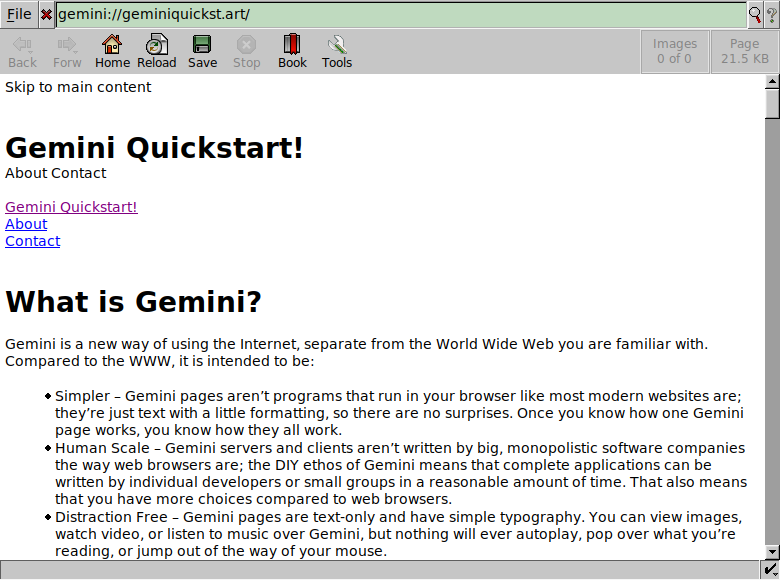

# Gemini plugin for Dillo

[Gemini][] protocol plugin for [Dillo][].

## Screenshot



## Install

Requires the `openssl` command-line tool.

[ansi2html](https://pypi.org/project/ansi2html/) is optionally required to render pages that use ANSI escape codes (e.g. for colors).

To install use:

```sh
$ make install
```

Created by [Charles E. Lehner](https://celehner.com/) along with other
[Dillo plugins](https://celehner.com/projects.html#dillo-plugins).
The original repo is hosted on the [SSB Network][SSB] using [git-ssb][].

## Sites to try

- <gemini://geminiquickst.art/>
- <gemini://geminiprotocol.net'>
- <gemini://gemini.conman.org/>

## See also

- [gemini.filter.dpi](https://github.com/boomlinde/gemini.filter.dpi) - Another
  Dillo Gemini plugin, implemented in Go, and more feature-complete than this
  one.

[Gemini]: https://en.wikipedia.org/wiki/Gemini_(protocol)
[Dillo]: https://dillo-browser.github.io/
[git-ssb]: %n92DiQh7ietE+R+X/I403LQoyf2DtR3WQfCkDKlheQU=.sha256
[SSB]: https://www.scuttlebutt.nz/

## License

FSFAP
